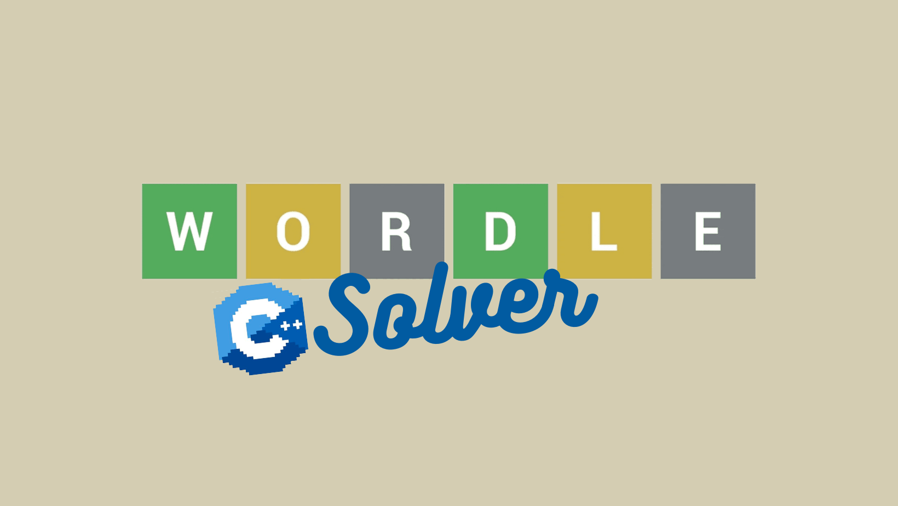
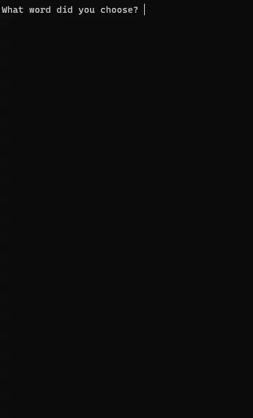

# Overview

The program found in this repository is a Wordle solver. Wordle is a popular mobile game where the player is given a five letter word to guess within five tries.

Once a guess is entered, the game will inform a player if a letter in the word was guessed correctly in the right spot by highling the letter in green.
Any letters found in the word, but not in the right spot will be highlighted yellow, and any letters not found in the word will be highlighted grey.

When using the program, the user will be able to enter their guess, and specify what color status the game assigned to each the letters. Then, based on the
letters and their color status, the program will generate a list of possible solutions for your next guess.

I wrote this short program hoping to practice some basic C++ concepts, like classes and data structures.

You can find a short video of a demonstration of my program running at the following link:

[Software Demo Video](https://youtu.be/a9tYNDIIfbM)



# How to Compile and Run

Run the following command to compile the program:

```bash

g++ -o wordle_solver wordle_solver.cpp

```

To run the program, use the following command:

```bash

./wordle_solver

```

# Development Environment

C++ as the programming language.

I used the following C++ libraries to include some basic functionalities in my program:

- iostream
- list
- vector
- string
- fstream
- algorithm
- cstring
- string.h

# Useful Websites

The following is a list of websites that were useful when creating this program.

- [How to check if letter is found in a word.](https://cplusplus.com/forum/beginner/142988/)
- [How to create and use a vector.](https://cplusplus.com/reference/vector/vector/)
- [C++ Classes and Objects](https://www.w3schools.com/cpp/cpp_classes.asp)
- [Vectors vs. Arrays](https://www.youtube.com/watch?v=VW8eDxB0c-s)
- [Basic C++ Syntax and Functionality](https://www.geeksforgeeks.org/c-programming-basics/#:~:text=C%2B%2B%20is%20a%20general%2Dpurpose,%2C%20Unix%2C%20Mac%2C%20etc.)

# Future Work

Some features that can be added in the future are:

- Ability to loop program.
- Retention throughout multiple guesses of what words wouldn't work.
- Basic GUI/Interface
